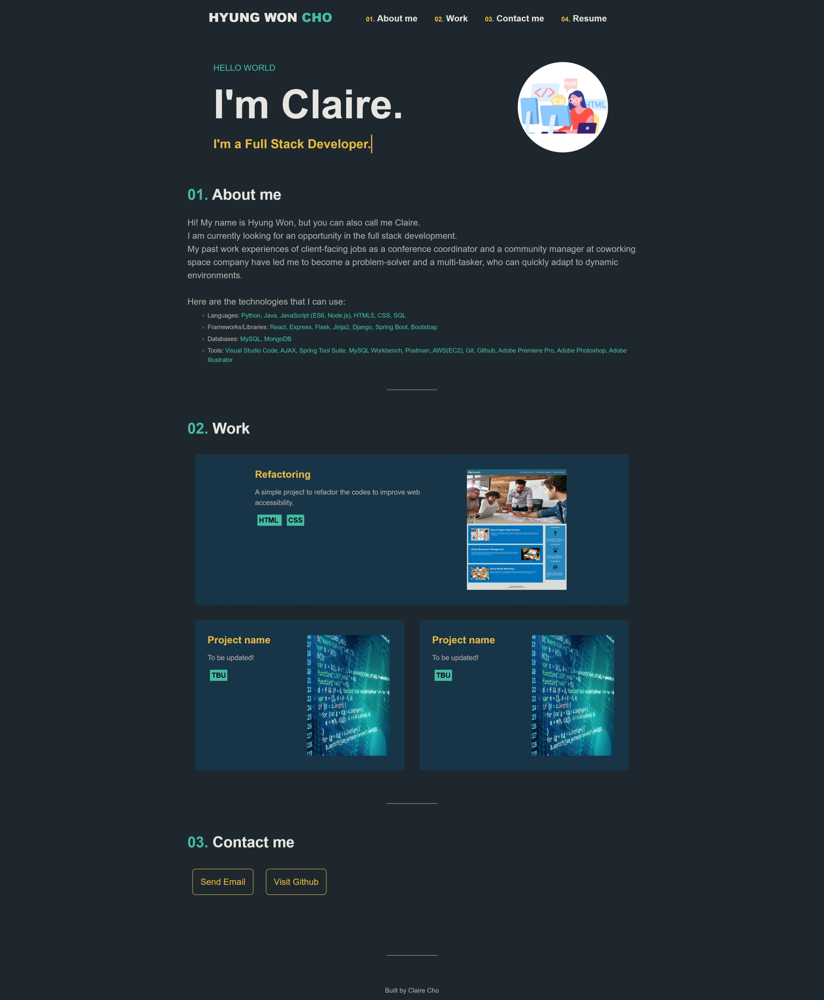
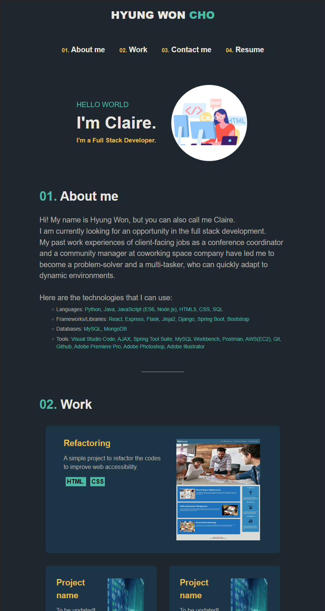
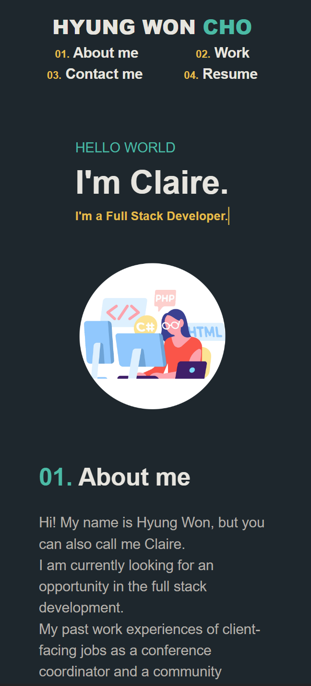
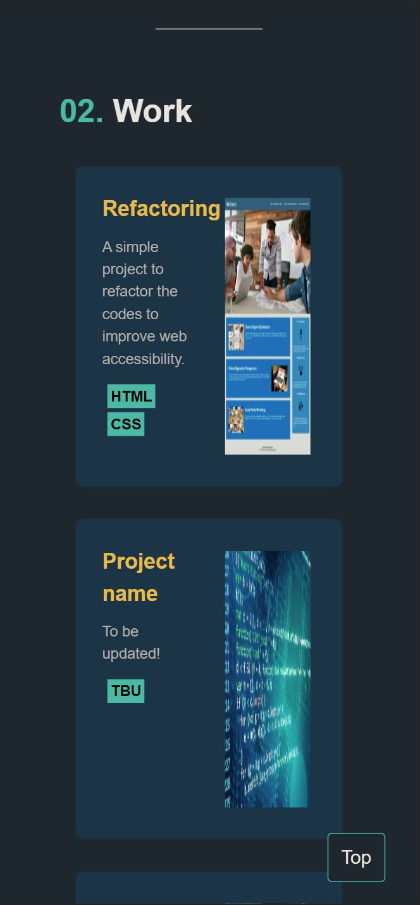

# Portfolio

## Description

This is my portfolio with responsive layouts. 
You can check out my profile, work, contact information, and resume from the link below:  
[https://clairehwcho.github.io/portfolio/](https://clairehwcho.github.io/portfolio/)

## Table of Contents
  - [Installation](#installation)
  - [Screenshots](#screenshots)
  - [License](#license)

## Installation

No special requirements.

## Screenshots

- Index page with width 992px

- Index page with width 768px

- Index page with width 390px

## License
Copyright © 2022 [Claire Cho](https://github.com/clairehwcho).