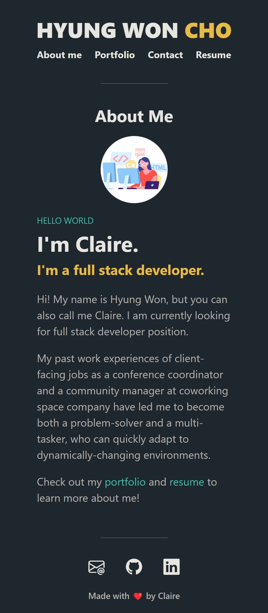
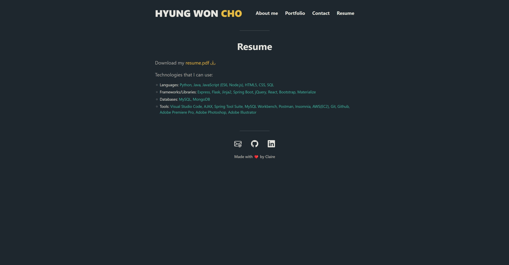

<!-- omit in toc -->
# Portfolio

<!-- omit in toc -->
## Description
This is a single-page portfolio app using react with responsive designs with mobile-first approach.

You can check out the deployed application from the link below: 
[https://clairehwcho.github.io/portfolio/](https://clairehwcho.github.io/portfolio/)

<!-- omit in toc -->
## Table of Contents
- [Installation](#installation)
- [Usage](#usage)
- [License](#license)

## Installation
No special requirements.

## Usage
- Responsive design for screens smaller than 768px (mobile-first design)

    

- Responsive design for screens with min-width of 768px

    

- Responsive design for screens with min-width of 992px

    

- Portfolio section

    

- Contact section

    

- Resume section

    

## License
Copyright © 2023 [Claire Cho](https://github.com/clairehwcho).
